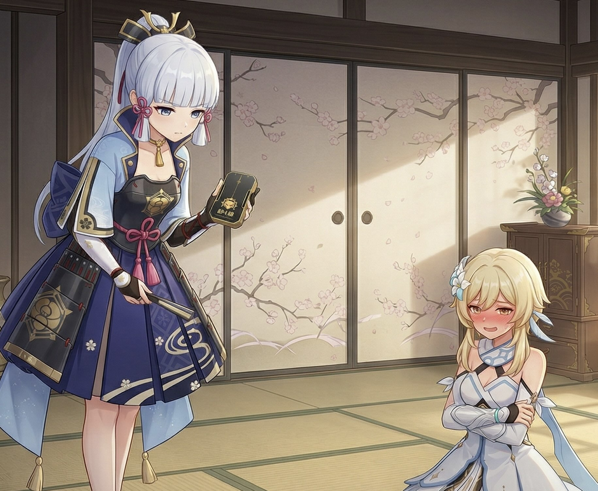
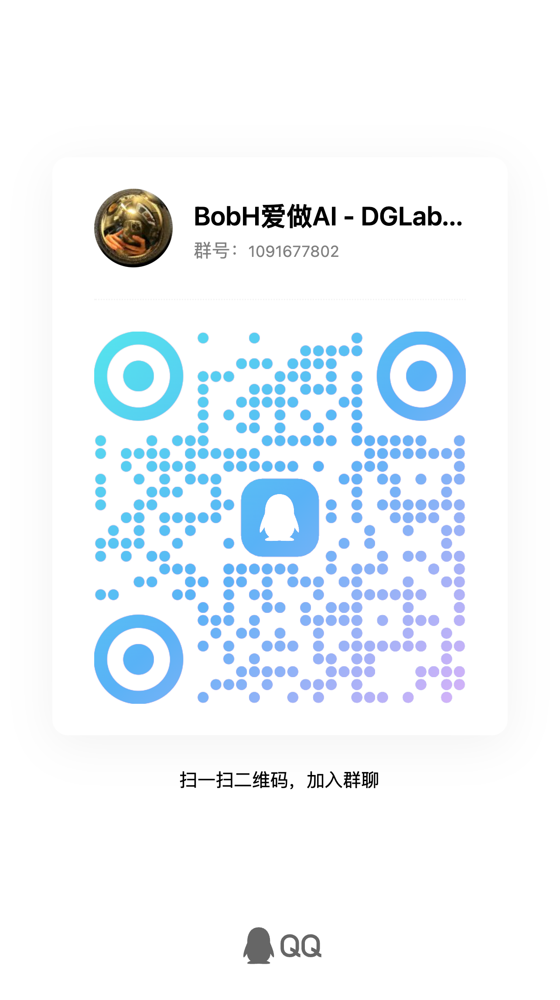

<div align="center">
  <h1>DGLabAI</h1>
  <p><strong>基于大语言模型的互动叙事运行时，支持结构化剧情推进、实时预览、Fish Speech 兼容 TTS 与郊狼 3.0 本地联动。</strong></p>
  <p>
    <a href="https://github.com/BobH233/DGLab-AI/actions/workflows/docker-image.yml">
      
    </a>
    <a href="https://github.com/BobH233/DGLab-AI/pkgs/container/dglab-ai">
      
    </a>
  </p>
</div>

---

DGLabAI 是一个面向互动叙事场景的 AI Runtime。它不把模型当作单纯的聊天接口，而是把世界草案生成、人工确认开局、正式剧情推演、事件流呈现、TTS 朗读与本地设备联动整合成一套完整工作流。

项目当前已经支持多角色剧情推进、SSE 实时预览、全文演出模式、Fish Speech 兼容 TTS，以及通过 DGLab-GameHub 接入郊狼 3.0 本地能力。对于准备自部署或二次开发的社区用户，仓库已经提供可直接使用的 Docker 镜像、`docker-compose.yml` 和配套中文文档。

**快速链接**

<div align="center">

| 🚀 快速开始 | ⚙️ 配置指引 | 📚 技术文档 |
| --- | --- | --- |
| [立即运行项目](#快速开始) | [配置模型、TTS 与郊狼](#配置指引) | [查看文档总览](./doc/README.md) |

| 🧱 架构设计 | 🔌 API 参考 | 💬 QQ 群交流 |
| --- | --- | --- |
| [了解系统结构](./doc/architecture.md) | [查看接口说明](./doc/api.md) | [加入社区交流](#社区交流) |

</div>

## 项目简介

DGLabAI 的核心目标，是让互动叙事从“模型输出一段文本”升级为“持续运行的剧情系统”：

- 先生成结构化世界草案，并允许人工修改后确认开局
- 再由单次共享编排推进多角色剧情，而不是每个角色各自调用一次模型
- 模型输出通过工具调用落成事件流、状态变更和设备动作意图
- 前端通过时间线、流式预览、单条朗读和演出模式来消费这些结构化结果

如果你想搭一个可以长期运行、可回放、可调试、可接本地设备的剧情系统，这个仓库就是围绕这个目标构建的。

## 效果展示

下面这些示例可以帮助访客快速理解 DGLabAI 的实际产出形式，包括可导出的剧情 PDF、带 TTS 的剧情演绎视频，以及实机交互演示。

| 封面 | 演示内容 |
| --- | --- |
| [](./doc/demo-pdf/%E7%A8%BB%E5%A6%BB%E7%9A%84%E5%BD%92%E6%9D%A5%E6%83%A9%E7%BD%9A%E6%B8%B8%E6%88%8F.pdf) | **示范 PDF：稻妻的归来惩罚游戏**<br/>导出示例，适合快速了解系统生成后的剧情呈现形式。<br/>[点击查看 PDF](./doc/demo-pdf/%E7%A8%BB%E5%A6%BB%E7%9A%84%E5%BD%92%E6%9D%A5%E6%83%A9%E7%BD%9A%E6%B8%B8%E6%88%8F.pdf) |
| [](./doc/demo-pdf/%E8%B4%A5%E6%88%98%E7%9A%84%E6%83%A9%E6%88%92%EF%BC%9A%E6%B5%B7%E7%A5%87%E5%B2%9B%E7%9A%84%E7%BB%9D%E5%AF%B9%E6%8C%87%E4%BB%A4.pdf) | **示范 PDF：败战的惩戒：海祇岛的绝对指令**<br/>另一份导出示例，用于展示剧情结构、排版与最终阅读效果。<br/>[点击查看 PDF](./doc/demo-pdf/%E8%B4%A5%E6%88%98%E7%9A%84%E6%83%A9%E6%88%92%EF%BC%9A%E6%B5%B7%E7%A5%87%E5%B2%9B%E7%9A%84%E7%BB%9D%E5%AF%B9%E6%8C%87%E4%BB%A4.pdf) |
| [](https://www.youtube.com/watch?v=OpJRyXQUbYc) | **YouTube：五郎 / 心海剧情演绎（带 TTS）**<br/>展示带 TTS 的剧情演绎效果与叙事节奏。<br/>[观看视频](https://www.youtube.com/watch?v=OpJRyXQUbYc) |
| [](https://www.youtube.com/watch?v=vqcvlXz2Tr4) | **YouTube：宵宫与旅行者荧剧情演绎（带 TTS）**<br/>展示另一组角色与配音配置下的剧情演出效果。<br/>[观看视频](https://www.youtube.com/watch?v=vqcvlXz2Tr4) |
| [](https://www.youtube.com/watch?v=wS94sgmAzE4) | **YouTube：神里绫华与旅行者荧实机交互 Demo**<br/>展示实际交互流程与运行时表现。<br/>[观看视频](https://www.youtube.com/watch?v=wS94sgmAzE4) |

当前完整交互链路大致如下：

`生成草案 -> 人工确认 -> 正式推演 -> TTS / 演出 -> 本地设备联动`

## 核心特性

- 结构化世界草案生成与人工确认开局
- 单次共享编排的多角色剧情推进
- SSE 实时预览与事件时间线呈现
- 分层记忆压缩、上下文装配与调试页
- Fish Speech 兼容 TTS、单条朗读与全文演出模式
- 郊狼 3.0 / DGLab-GameHub 本地联动
- Docker / Docker Compose 一键部署

## 技术栈

- 前端：Vue 3、Vue Router、Vite、Vitest
- 后端：Node.js、Express、MongoDB、Zod
- 共享契约：TypeScript + Zod
- 模型接入：OpenAI-compatible API
- TTS：Fish Speech API-compatible
- 部署：Docker、Docker Compose、GHCR

## Star 趋势

[](https://star-history.com/#BobH233/DGLab-AI&Date)

## 快速开始

推荐直接使用仓库根目录的 [`docker-compose.yml`](./docker-compose.yml)。项目已经通过 CI 自动构建并发布镜像，社区用户不需要先本地构建镜像即可启动。

### 1. 启动服务

```bash
docker compose up -d
```

默认会启动以下服务：

- `app`：`ghcr.io/bobh233/dglab-ai:latest`
- `mongodb`：MongoDB 7
- `coyote-game-hub`：`ghcr.io/bobh233/dg-lab-coyote-game-hub:latest`

### 2. 访问地址

- DGLabAI：`http://localhost:17039`
- Coyote Game Hub：`http://localhost:18920`

### 3. 数据目录

`docker-compose.yml` 默认会在当前目录挂载以下数据：

- `./mongo_data`
- `./tts_cache`
- `./coyote_data`

你可以按需修改 compose 文件里的挂载路径。

## 配置指引

服务启动后，建议按下面顺序完成配置。

### 1. 配置 LLM 后端

进入 Web 界面的“设置”页，至少补齐以下字段：

- `API Base URL`
- `API Key`
- `Model`
- `Temperature`
- `Top P`
- `Max Tokens`
- `Request Timeout`

项目当前按 OpenAI-compatible 接口接入模型后端。为了获得更好的剧情演绎效果，推荐优先尝试 `gemini-3.1-pro`。

### 2. 配置 TTS

“设置”页中内置了 TTS 配置区，可以填写：

- `TTS API Base URL`
- 角色与 `reference_id` 的映射

TTS 接口兼容 Fish Speech 的调用方式。Fish Speech 的部署教程和服务搭建方式请参考其官方仓库：

- [Fish Speech 官方 GitHub 仓库](https://github.com/fishaudio/fish-speech)

配置完成后，你可以在设置页通过后端代理获取 `reference_id` 列表，再把剧情中的角色名映射到对应音色。

### 3. 配置郊狼 3.0 / DGLab-GameHub

进入导航栏中的“郊狼配置”页，在“游戏连接码”中填写 DGLab-GameHub 提供的连接码即可。

如果你使用仓库默认的 Docker Compose 方案，Game Hub 服务镜像为：

- `ghcr.io/bobh233/dg-lab-coyote-game-hub:latest`

该配置保存在浏览器本地，用于让前端把本机设备能力同步给剧情系统。

## 本地开发（非 Docker）

如果你希望自己安装环境并以开发模式运行，也可以直接在本地启动。

### 环境要求

- Node.js 20+
- npm 10+
- MongoDB 6 或 7

### 安装依赖

```bash
npm install
```

### 启动后端

```bash
npm run dev:server
```

默认监听：`http://localhost:3001`

### 启动前端

```bash
npm run dev:web
```

默认访问：`http://localhost:5173`

### 必要环境变量

```bash
PORT=3001
MONGODB_URI=mongodb://127.0.0.1:27017
MONGODB_DB=dglab_ai
AUTH_PASSWORD=change-me
```

如需 TTS，还可以额外配置缓存目录和分段相关环境变量。更完整的开发、部署和排障说明请查看：

- [开发与部署文档](./doc/development.md)

## 文档索引

如果你想继续深入了解实现细节，可以从下面这些文档开始：

- [总体文档入口](./doc/README.md)
- [架构设计](./doc/architecture.md)
- [开发与部署](./doc/development.md)
- [API 参考](./doc/api.md)

## 已知说明

- 当前自动推进依赖打开中的前端会话页，不是完全脱离前端运行的后台守护任务
- TTS 依赖外部兼容服务与 `reference_id` 映射，不是仓库内置的独立语音服务
- 本地设备联动依赖浏览器侧的 DGLab-GameHub 连接配置，真正的设备执行发生在用户本机

## 社区交流

欢迎加入项目交流 QQ 群，一起讨论玩法、部署、适配和后续共建。


