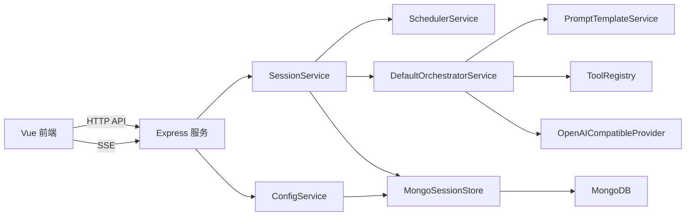
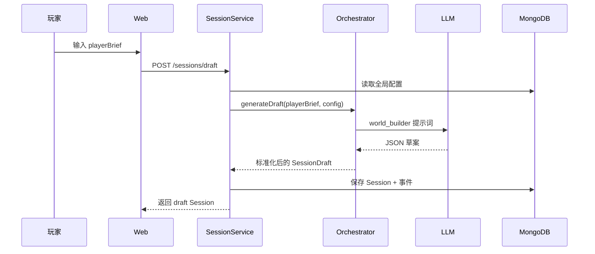
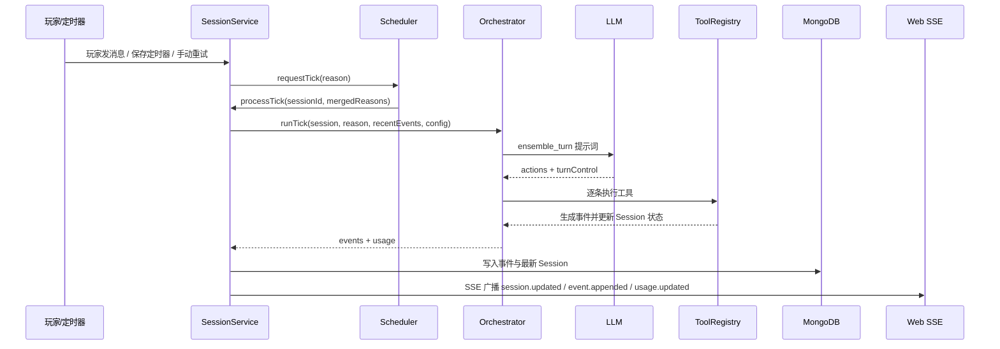

# 架构设计

## 1. 项目定位

DGLabAI 是一个“单玩家 + 多智能体”的互动叙事引擎原型。它把玩家输入转化为结构化剧情草案，再把后续的每次剧情推进变成一次共享的多角色动作规划，最终以事件流形式驱动前端展示。

与普通聊天应用相比，这个项目的核心不是“直接生成回复”，而是：

- 先生成可编辑的故事设定草案
- 再用结构化工具调用推进剧情
- 最后把剧情推进结果持久化为事件

## 2. 总体架构

## 3. 分层说明

### 前端

- 负责新建 Session、编辑草案、确认草案、发送消息、设置自动推进和查看时间线
- 使用 REST 拉取数据，使用 SSE 接收增量更新

### 后端 API 层

- `app.ts` 完成应用装配
- `configRoutes.ts` 暴露模型配置接口
- `sessionRoutes.ts` 暴露 Session 生命周期接口和事件流接口

### 服务层

- `ConfigService` 管理全局 LLM 配置
- `SessionService` 管理 Session 生命周期、事件持久化和调度协作
- `SchedulerService` 管理定时器和 Tick 合并
- `DefaultOrchestratorService` 负责调用模型生成草案和推进回合

### 基础设施层

- `MongoSessionStore` 持久化配置、Session 和事件
- `OpenAICompatibleProvider` 兼容 OpenAI Chat Completions 风格接口
- `FilePromptTemplateService` 读取并渲染 Markdown 提示词模板
- `WebChannelAdapter` 用 SSE 向 Web 前端广播事件

### 共享模型层

- `packages/shared` 保存所有前后端共享 schema、类型、事件枚举、工具目录和请求结构

## 4. 核心流程

### 4.1 草案生成流程

说明：

- 世界草案由一次单独的 LLM 调用生成
- 输出并不要求模型严格命中内部类型，编排器会做一次“宽松字段归一化”
- 草案生成后，Session 状态为 `draft`

### 4.2 正式推演流程

说明：

- 当前是“整组角色共用一次模型调用”的架构，不是每个 Agent 单独调用一次模型
- 这样可以把角色协作、节奏和先后顺序放在一次决策里完成
- 同一轮回合中的对白、动作、停顿、剧情变化都由工具调用表达

## 5. Session 生命周期

### `draft`

- 刚生成草案，允许编辑
- 不能发送正式消息推进剧情

### `active`

- 草案已确认
- 可以接收玩家消息、定时推进和手动重试

### `ended`

- 故事结束
- 不再继续推进

## 6. 事件驱动模型

项目的核心持久化单位是 `SessionEvent`。模型的输出不会直接变成页面文本，而是先变成事件，再由前端时间线解释这些事件。

主要事件类型包括：

- Session 生命周期：`session.created`、`draft.generated`、`draft.updated`、`session.confirmed`
- 玩家输入：`player.message`
- 智能体输出：`agent.speak_player`、`agent.speak_agent`、`agent.reasoning`、`agent.stage_direction`
- 工具效果：`agent.device_control`、`agent.story_effect`
- 场景状态：`scene.updated`
- 系统状态：`system.tick_started`、`system.tick_completed`、`system.tick_failed`
- 自动推进：`system.timer_updated`
- 节奏控制：`system.wait_scheduled`
- 结局：`system.story_ended`
- 用量统计：`system.usage_recorded`

## 7. 数据持久化设计

MongoDB 使用了三类核心数据：

- `app_configs`：保存全局模型配置
- `sessions`：保存 Session 最新快照
- `session_events`：保存按序追加的事件流

设计特点：

- Session 快照用于快速恢复当前状态
- 事件流用于还原过程、驱动前端和分析行为
- Session 使用 `lastSeq` 记录事件序号，便于顺序追加

## 8. 关键设计取舍

### 单次共享编排，而非多次角色逐个推理

优点：

- 降低每轮 Token 和延迟
- 保证一轮内多个角色动作有统一节奏
- 减少跨 Agent 推理结果不一致的问题

代价：

- 无法直接观测“每个 Agent 单独思考”的独立上下文
- `byAgent` 级别的真实 Token 统计当前没有落地

### 一切输出尽量工具化

优点：

- 前端展示更稳定
- 事件可以持久化与回放
- 后续接真实硬件或外部系统时更容易扩展

代价：

- 提示词约束更重
- 工具 schema 与提示词必须严格同步

### 通道适配器预留扩展，而当前只实现 Web

优点：

- 架构上已经为 QQ 机器人等渠道预留接口

现状：

- 当前仅实现 `WebChannelAdapter`
- 其他接入端仍需补充“接收消息 + 广播消息”的适配实现

## 9. 当前实现中的保留项

- `director_agent.md` 与 `support_agent.md` 模板已存在，但当前正式推演不使用它们
- `pendingWaits` 数据结构已定义，但当前 `wait` 工具只表现为同一轮展示停顿
- `UsageStats.byAgent` 已定义，但当前实际只更新会话总量与每次调用记录

这些内容说明项目已经考虑到更细粒度的扩展方向，但目前还处于原型到可用版本之间的阶段。
