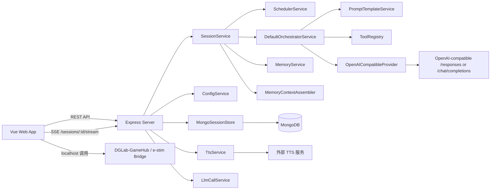
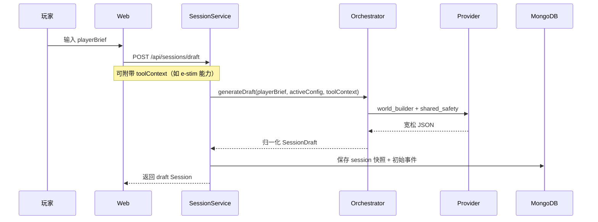
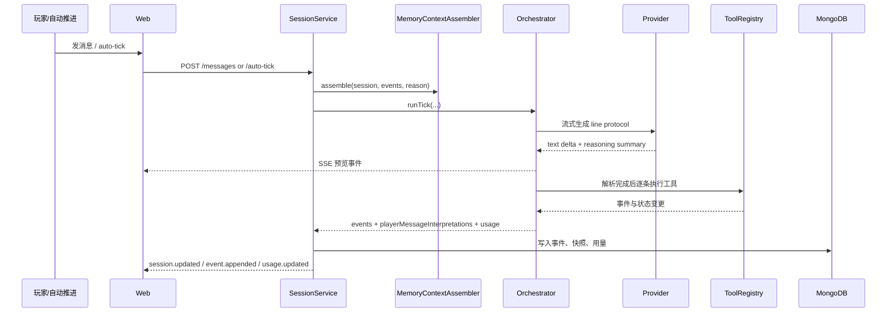

# 架构设计

## 1. 项目定位

DGLabAI 现在已经不是“只有草案生成 + 会话页”的最小原型，而是一套围绕互动叙事运行时逐步长出来的系统：

- 先由模型生成结构化世界草案
- 允许人工审阅和编辑后再确认开局
- 在正式推演阶段使用单次共享编排推进多角色回合
- 用工具调用把模型决策落成事件、状态和设备动作
- 通过 SSE 将正式事件和 LLM 预览流同步给前端
- 提供 TTS 单条朗读、全文演出模式、打印导出和调试视图
- 允许前端把本地 e-stim 设备能力同步给后端参与本轮编排

系统核心不是“生成一段回复”，而是维护一个长期存在、可解释、可回放、可扩展的叙事运行时。

## 2. 总体架构

## 3. 分层说明

### 3.1 前端层

前端承担的职责已经扩展为：

- 登录并保存访问密码
- 新建与编辑草案
- 运行正式会话与时间线播放
- 显示流式 LLM 预览卡片
- 单条 TTS 朗读与全文演出模式
- PDF 打印导出
- 记忆调试、模型调用历史、构建信息查看
- 维护模型后端配置、TTS 配置
- 维护仅保存在本地浏览器中的 e-stim 设备配置

前端不直接调用 LLM，也不做记忆压缩；它主要消费结构化 Session、事件流、TTS 状态和 SSE 预览事件。

### 3.2 API 与服务层

后端 API 依旧很薄，核心职责集中在服务层：

- `ConfigService`：管理多模型后端配置和全局 TTS 配置
- `SessionService`：管理 Session 生命周期、Tick、SSE、记忆刷新、预览快照恢复
- `SchedulerService`：做 Session 级 Tick 合并与去重
- `DefaultOrchestratorService`：渲染提示词、流式读取 line protocol、执行工具
- `MemoryService`：维护 turn / episode / archive 分层记忆
- `MemoryContextAssembler`：把状态、记忆、消息账本和本轮上下文拼装成推演输入
- `TtsService`：健康检查、reference 列表、音频合成、缓存和全文批量生成
- `LlmCallService`：分页查询全部模型调用记录

### 3.3 基础设施层

- `MongoSessionStore`：持久化会话快照、事件、配置、LLM 调用、TTS 缓存和批量任务
- `OpenAICompatibleProvider`：统一对接 OpenAI-compatible 接口，优先尝试 `/responses` 流式推理，再回退到 `/chat/completions`
- `LineProtocolTurnParser`：把流式文本解析为结构化 `ActionBatch`，同时产生预览事件
- `FilePromptTemplateService`：从磁盘读取 Markdown 模板并维护提示词版本
- `WebChannelAdapter`：向浏览器 SSE 连接广播增量事件

### 3.4 共享契约层

`packages/shared` 是前后端共同依赖的数据契约中心，定义了：

- Session、Event、Usage、Memory、TTS 等 Zod schema
- 工具目录与默认开关
- e-stim `toolContext`
- SSE 事件类型
- 可朗读内容 `SessionReadableContent`
- LLM 调用记录、TTS 批量任务等结构

## 4. 核心运行链路

### 4.1 草案生成

与早期版本相比，草案生成现在还会吸收工具世界观钩子，比如：

- `control_vibe_toy`
- `control_e_stim_toy`

也就是说，工具可用性已经会影响世界设定阶段，而不只是正式推演阶段。

### 4.2 草案确认

确认时系统会：

- 将 `draft` 冻结到 `confirmedSetup`
- 保存 `llmConfigSnapshot`
- 保存提示词版本快照 `promptVersions`
- 合并本次请求带入的 `toolContext`
- 将 `status` 切换为 `active`
- 如有初始身体道具状态，写入 `player.body_item_state_updated`
- 立即请求一次 `session_confirmed` Tick

这一步把“可编辑设定阶段”和“正式运行阶段”明确隔开。

### 4.3 正式推演

当前正式推演有三个关键特征：

- 每个 Tick 仍然只有一次共享 LLM 调用
- 这次调用是流式的，前端可以边看边预览 action 草稿
- 正式事件只有在 line protocol 解析完成并通过工具执行后才会持久化

### 4.4 TTS 与演出模式

TTS 现在已经是一条独立链路：

1. 前端在设置页保存 TTS Base URL 和角色 `reference_id` 映射
2. 后端 `TtsService` 根据 Session 和事件构造可朗读内容
3. 朗读请求命中缓存时直接返回本地缓存音频
4. 未命中时再向外部 TTS 服务请求音频并写入缓存
5. 演出模式会先检查所有可朗读卡片是否都具备可播放音频和时长
6. 如果不完整，可由后端批量合成缺失条目

这条链路和正式推演解耦，但共享同一份 Session / Event 数据。

### 4.5 本地 e-stim 集成

e-stim 是一个“前端本地能力 + 后端上下文注入”的混合设计：

- 浏览器本地保存连接码、通道、电极位置、强度曲线和允许波形
- 新建草案、确认会话、发消息、自动推进前，前端会把 `toolContext.eStim` 同步给后端
- 提示词会把这些本地能力描述进世界观或本轮工具上下文
- 模型可调用 `control_e_stim_toy`
- 正式事件只记录“前端待执行”的设备控制意图
- 真正的本地设备调用发生在前端与 localhost bridge 之间

因此，这条能力不会要求服务端直接连用户设备。

## 5. 记忆链路

### 5.1 记忆层级

- `recentRawTurns`：最近成功回合的原始事件窗口
- `turnSummaries`：单回合摘要
- `episodeSummaries`：多回合压缩后的中期摘要
- `archiveSummary`：更长期的归档摘要

### 5.2 上下文装配

送入正式推演提示词的不是一段历史文本，而是一组结构化上下文块：

- `sessionDraft`
- `storyState`
- `agentStates`
- `playerBodyItemState`
- `archiveBlock`
- `episodeBlocks`
- `turnSummaryBlocks`
- `recentRawTurnsBlock`
- `playerMessagesBlock`
- `tickContextBlock`

这让系统既保留近期细节，又能把长期历史压到可控体量。

### 5.3 调试可观测性

记忆链路除了服务端内部运行，还显式暴露给前端：

- `/sessions/:id/debug` 页面查看 assembled context
- `memory-debug` API 返回实际被拼装的上下文块
- 可看到字符预算、被丢弃的 block、最近原始回合和消息队列

## 6. 事件驱动模型

系统事实的最小单位依然是 `SessionEvent`。但现在事件类型比早期更多，除了常规剧情事件，还包括：

- 生命周期：`session.created`、`draft.generated`、`draft.updated`、`session.confirmed`
- 玩家状态：`player.message`、`player.message_interpreted`、`player.body_item_state_updated`
- 角色输出：`agent.speak_player`、`agent.speak_agent`、`agent.reasoning`、`agent.stage_direction`
- 效果与设备：`agent.device_control`、`agent.story_effect`
- 场景状态：`scene.updated`
- Tick 状态：`system.tick_started`、`system.tick_completed`、`system.tick_failed`
- 节奏控制：`system.wait_scheduled`
- 自动推进：`system.timer_updated`
- 结局与用量：`system.story_ended`、`system.usage_recorded`

另外，SSE 中还存在一组“预览事件”，它们不会落库，但会实时驱动前端的预览卡片：

- `llm.turn.started`
- `llm.action.*`
- `llm.reasoning_summary.delta`
- `llm.turn.control`
- `llm.turn.player_message_interpretations`
- `llm.turn.player_body_item_state`
- `llm.turn.completed`
- `llm.turn.failed`
- `llm.preview.snapshot`

## 7. 数据持久化

MongoDB 中当前至少有这些核心集合：

- `app_configs`：模型后端配置 + 全局 TTS 配置
- `sessions`：Session 最新快照
- `session_events`：事件日志
- `llm_calls`：全部模型调用记录
- `tts_audio_cache`：TTS 音频缓存索引
- `session_tts_batch_jobs`：全文 TTS 批量生成任务状态

这种设计带来的好处是：

- Session 恢复读取快照即可
- 时间线、打印、朗读、演出模式都可复用同一份事件流
- LLM 调用、TTS 和正式剧情可以分别排查

## 8. 自动推进的真实实现

自动推进的本质仍然是“前端主导 + 后端仲裁”：

- Session 中持久化 `timerState`
- 会话页在前端周期性检查倒计时
- 只有页面可见、当前不在播放停顿、没有 in-flight Tick 时才会请求 `/auto-tick`
- 后端再根据 `enabled`、`nextTickAt`、`inFlight` 做最终判定

所以它依赖打开中的会话页，而不是独立后台守护进程。

## 9. 关键设计取舍

### 9.1 共享回合编排，而不是多角色多次调用

优点：

- 降低 Token 成本
- 保持单回合节奏统一
- 便于把工具执行组织成一个可解释的 action batch

代价：

- 不提供每个角色完全独立的推理轨迹
- `usageTotals.byAgent` 仍未做真实分摊

### 9.2 事件流 + 预览流并存

优点：

- 用户能提前看到模型正在组织什么动作
- 正式落库事实仍然由工具执行后决定
- 刷新页面时还能通过 `llm.preview.snapshot` 恢复当前预览

代价：

- 前端状态机会更复杂
- 需要同时维护“暂态预览”和“正式事件”两套展示逻辑

### 9.3 服务端只描述设备意图，前端执行本地硬件

优点：

- 服务端不需要直接触达用户局域网设备
- 本地设备能力能安全地作为 `toolContext` 注入剧情
- 无设备时也可以以 simulated / pending 形式退化运行

代价：

- 真正的设备执行与正式剧情事件不是同一个事务
- 设备状态同步依赖前端是否及时上报

### 9.4 TTS 采用“按内容缓存 + 批量补全”

优点：

- 单条点击朗读与全文演出模式复用同一缓存
- 重新打开会话后无需重复合成已存在音频
- 全文播放前可以显式检查缺口

代价：

- 需要额外维护缓存键、音频时长和批量任务状态
- TTS 配置与角色映射错误时，问题会在播放阶段暴露
