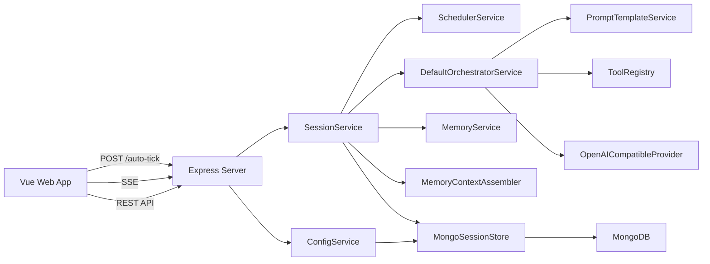
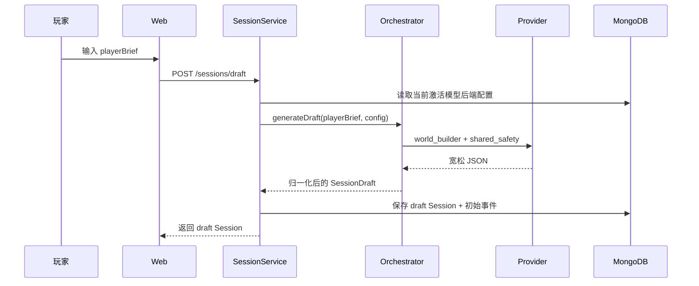
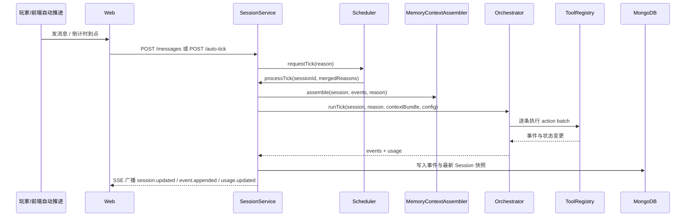

# 架构设计

## 1. 项目定位

DGLabAI 是一个“单玩家 + 多智能体 + 持续会话”的互动叙事原型。系统的核心目标不是生成一段聊天文本，而是把：

- 世界设定补全
- 人工审阅确认
- 共享回合编排
- 工具化动作执行
- 事件流持久化
- 长程记忆压缩
- 前端实时解释

组织成一套可持续运行的叙事系统。

## 2. 总体架构

## 3. 分层说明

### 3.1 前端层

前端负责：

- 新建草案
- 编辑和确认草案
- 发送玩家消息
- 展示会话时间线
- 保存自动推进设置
- 触发前端自动推进
- 查看记忆调试视图
- 管理多模型后端配置

前端不理解提示词内部细节，也不直接执行工具，只消费后端返回的 Session 快照和事件流。

### 3.2 API 与服务层

后端 API 很薄，核心业务集中在服务层：

- `ConfigService`：读写多后端模型配置与激活后端
- `SessionService`：管理 Session 生命周期、Tick、事件、SSE 广播和记忆刷新
- `SchedulerService`：合并同一 Session 的多个待处理触发原因
- `DefaultOrchestratorService`：负责世界构建和正式回合编排
- `MemoryService`：生成和压缩多层记忆摘要
- `MemoryContextAssembler`：把当前状态、记忆块、近期原始回合和玩家账本组装成推理上下文

### 3.3 基础设施层

- `MongoSessionStore`：持久化配置、Session 快照和事件流
- `OpenAICompatibleProvider`：对接模型接口，统一结构化 JSON 输出
- `FilePromptTemplateService`：从磁盘读取并渲染提示词模板
- `WebChannelAdapter`：通过 SSE 向前端广播增量事件

### 3.4 共享模型层

`packages/shared` 提供所有前后端共享的：

- Zod schema
- TypeScript 类型
- 事件类型
- 工具目录
- 请求/响应结构
- 记忆状态模型

这一层是项目的数据契约中心。

## 4. 核心流程

### 4.1 草案生成

关键点：

- 草案阶段是独立的一次模型调用
- 模型输出可以是宽松 JSON，后端会进行归一化
- 生成完成后 Session 状态为 `draft`

### 4.2 草案确认

确认时系统会：

- 将 `draft` 冻结为 `confirmedSetup`
- 保存当前激活模型后端配置快照
- 保存提示词版本快照
- 把 Session 状态改为 `active`
- 立即请求一次 `session_confirmed` Tick

这一步的作用是把“可编辑设计阶段”和“正式运行阶段”分离开。

### 4.3 正式推演

关键点：

- 每个正式回合只有一次模型调用
- 工具执行后才会形成最终事件
- 事件流是前端时间线和记忆系统的共同基础

## 5. 记忆链路

项目实现了分层记忆，而不是简单拼接全部历史事件。

### 5.1 记忆层级

- `recentRawTurns`：最近若干个成功回合的原始事件窗口
- `turnSummaries`：每个成功回合的摘要
- `episodeSummaries`：多个 turn 摘要压缩后的中期摘要
- `archiveSummary`：更长期的归档摘要

### 5.2 生成方式

- 优先使用规则抽取生成 turn 摘要
- 当规则摘要信息不足时，再回退为 LLM 摘要
- 当 turn 数量超阈值时，向上压缩为 episode
- 当 episode 数量超阈值时，进一步压缩为 archive

### 5.3 上下文装配

真正送入正式推演提示词的不是单一历史文本，而是：

- 当前 `confirmedSetup` 或 `draft`
- 当前 `storyState`
- 当前 `agentStates`
- `archiveBlock`
- `episodeBlocks`
- `turnSummaryBlocks`
- `recentRawTurnsBlock`
- `playerMessagesBlock`
- `tickContextBlock`

这使上下文既保留近期细节，又避免无限增长。

## 6. 事件驱动模型

系统的基本事实单位是 `SessionEvent`。模型不会直接生成页面文本，而是先生成工具调用，再被执行为事件。

当前主要事件包括：

- 生命周期：`session.created`、`draft.generated`、`draft.updated`、`session.confirmed`
- 玩家输入：`player.message`
- 角色输出：`agent.speak_player`、`agent.speak_agent`、`agent.reasoning`、`agent.stage_direction`
- 叙事效果：`agent.device_control`、`agent.story_effect`
- 场景状态：`scene.updated`
- Tick 状态：`system.tick_started`、`system.tick_completed`、`system.tick_failed`
- 自动推进：`system.timer_updated`
- 节奏控制：`system.wait_scheduled`
- 结束与用量：`system.story_ended`、`system.usage_recorded`

## 7. 数据持久化

MongoDB 中存在三类核心数据：

- `app_configs`：多后端模型配置
- `sessions`：Session 最新快照
- `session_events`：按序追加的事件日志

设计动机：

- 快照便于恢复最新状态
- 事件流便于回放、调试和生成记忆
- `lastSeq` 用于保证事件顺序追加

## 8. 自动推进的真实实现

当前代码里的自动推进不是“后端后台定时器守护进程”，而是“前端倒计时 + 后端仲裁”。

具体表现为：

- Session 持久化 `timerState.enabled/intervalMs/nextTickAt`
- 会话页通过 `setInterval` 刷新倒计时
- 到点后前端调用 `/sessions/:id/auto-tick`
- 后端检查是否可触发，再向 `SchedulerService` 请求 Tick
- `SchedulerService` 只负责合并原因和防止重复 flush

因此，自动推进依赖打开中的会话页，不适合作为脱离前端的后台任务系统来理解。

## 9. 关键设计取舍

### 9.1 共享回合编排，而不是逐角色独立推理

优点：

- 降低总调用次数和 Token 成本
- 保证单回合内角色顺序和节奏统一
- 减少代理间上下文分叉

代价：

- 不直接暴露“每个角色单独思考”的完整轨迹
- `byAgent` 级别的真实用量分摊目前没有实现

### 9.2 事件驱动，而不是直接渲染模型原文

优点：

- 前端语义更稳定
- 事件可持久化、重放和调试
- 更容易接入外部设备或其他渠道

代价：

- 提示词与工具 schema 必须长期同步
- 输出约束更严格

### 9.3 分层记忆，而不是原文无限拼接

优点：

- 长程连续性更稳
- 提示窗口成本可控
- 可为调试页提供可解释记忆视图

代价：

- 需要额外摘要与压缩逻辑
- 记忆质量依赖摘要策略

## 10. 当前边界

- 只有 Web 前端和 SSE 通道
- 没有用户鉴权与权限控制
- `wait` 更像界面节奏事件，不是独立未来任务
- 保留了 `director_agent.md`、`support_agent.md`，但正式链路不使用
- 自动推进依赖前端活跃页面
